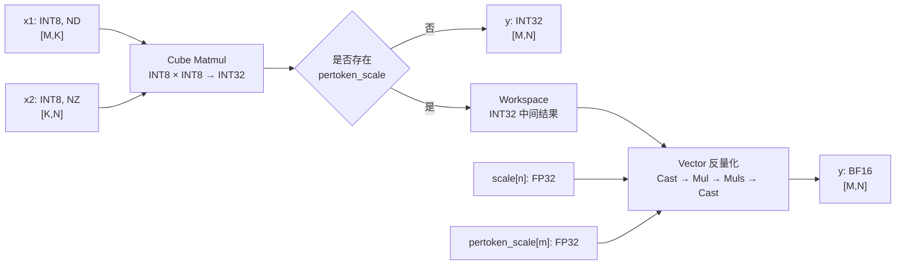

# 团队实践报告

## 一、团队信息与贡献说明

### 1.1 团队基本信息

- **团队标识（组号）**：LLD
- **CANNJudge 提交账号**：Zhangjiaqi123
- **CANNJudge 提交结果或链接**：

### 1.2 团队成员分工与贡献

| 姓名 | GitCode 账号 | 负责模块/任务分工 | 实际贡献说明 | 对应 commit hash |
|------|-------------|------------------|--------------|-----------------|
| 张佳琦 | Zhangjiaqi123 | 任务一：TilingData 结构体设计 + Tiling 函数实现；整体架构设计与集成；算子性能优化 | 完成 `QmmCustomTilingData` 结构体设计，包含 `TCubeTiling`、分块参数（`mBlockNum`/`nBlockNum`/`singleM`/`singleN`）等字段；实现 `CalcQmmTiling` 函数，针对 Qwen3-8B 热点 shape（M≤64 小M场景、大M场景）设计分块策略；实现 workspace 大小精确计算（pertoken 模式下 M×N×sizeof(int32_t)）；补充边界测试 |  |
| 黄文艺 | yuzhiliunian | 任务四~六：.ipynb 编写、算子编译与功能/性能测试、模型接入测试；团队报告撰写 | 在 Jupyter Notebook 中搭建完整全流程：环境准备 → 算子代码生成 → 编译集成 → 单算子精度比对 → 单算子性能测试（含 profiling）→ Qwen3-8B 模型接入 → 模型性能测试；编写 `benchmark_qmm_custom` 等测试脚本；完成团队实践报告整理与汇总 | [对应 commit hash] |
| 刘宇轩 | uid_abc123z | 任务二~三：A8W8→INT32 Kernel（QmmCubeBasicKernel）实现；A8W8→BF16 per-token 反量化 Kernel（QmmPertokenKernel）实现；算子 Bug 修复与迭代优化 | 共进行 5 轮迭代优化：v1~v3 实现基础 Cube 计算与分块策略；v4 修复 B 矩阵格式（从 ND 修正为与测试脚本 npu_format_cast 一致的 NZ 格式）、增加 `__mix__(1,2)` 混合核支持、完善 prof 框架宏定义；v5 修复 `mm_.Init()` 在 Vector(AIV) 核上非法调用的 bug（增加 `ASCEND_IS_AIC`/`ASCEND_IS_AIV` 条件分支）；使用 `REGIST_MATMUL_OBJ` 替代手动 mm.Init 调用，解决 Matmul 高阶 API 对象注册问题 | [对应 commit hash] |

### 1.3 团队协作说明

本团队采用"分模块开发 + 集中联调"的协作模式，具体过程如下：

**任务拆分：**
- 根据算子开发的全链路（Tiling 设计 → Kernel 实现 → 编译集成 → 测试验证 → 模型接入），拆分为三个相对独立的模块：
  - **Tiling 模块**（张佳琦）：负责 `QmmCustomTilingData` 结构体定义与 `CalcQmmTiling` 函数实现，需综合考虑硬件 AI Core 数量、Cube 计算单元分块粒度（baseM/baseN/baseK）、不同 shape 下的多核并行策略等
  - **Kernel 模块**（刘宇轩）：负责两条 Kernel 路径的实现——任务二（Cube-only INT32 输出）与任务三（Cube+Vector 混合核 BF16 反量化输出），需处理 AIC/AIV 混合核编程、MTE→Vector 流水并行、`REGIST_MATMUL_OBJ` 对象注册等关键问题
  - **集成测试模块**（黄文艺）：负责将 Tiling 与 Kernel 在 Notebook 中集成、编译，编写测试用例验证精度与性能，最终接入 Qwen3-8B 模型进行端到端测试

**代码汇总与评审：**
- 各成员在本地完成开发后，通过 GitCode 仓库提交 PR，由团队负责人（张佳琦）进行代码评审和合并
- 关键 Bug（如 v4 中 B 矩阵 ND/NZ 格式不匹配、v5 中 AIC/AIV 混合核条件分支缺失）通过集体讨论定位，刘宇轩负责修复，张佳琦确认修复方案的正确性

**集成验证：**
- 黄文艺在 Notebook 中搭建自动化测试流程：`%%writefile` 写入 asc 文件 → 调用 `bash build.sh` 编译 → 单算子精度比对（cosine similarity）→ 单算子性能测试（profiling 采集）→ 模型替换与推理测试
- 每次 Kernel/Tiling 优化后，全体成员共同分析性能 profiling 结果（`kernel_details.csv`），确认优化效果

**工具使用与 AI 辅助：**
- 团队合理使用 AI 辅助工具进行代码审查、Bug 定位和报告撰写，所有代码均经过人工理解和验证，未引入未被理解的外部代码

---

## 二、结果展示

### 2.1 单算子精度比对结果

**测试环境：** 昇腾 910B + CANN 9.0.0

**测试方法：**
- 随机生成 INT8 输入矩阵 x1（shape [M, K]）和 x2（shape [K, N]）
- 参考实现：`torch.matmul(x1.float(), x2.float())` + 反量化公式 `out_fp32 * scale * pertoken_scale`
- 自定义算子输出与参考结果进行 Cosine Similarity 比对

**测试结果：**

> **详细数据：** 精度比对结果以 Notebook 中实际运行输出为准。

### 2.2 单算子性能测试结果

**测试方法：**
- 使用 Ascend C profiling 工具采集各 shape 下 QmmCustom 算子的执行耗时
- 对比不同分块策略（v1~v5）的优化效果
- 重点关注 Qwen3-8B 中的热点 shape

**性能优化历程：**

> **注：** 具体耗时数据以 Notebook 中 profiling 实际运行输出为准。性能优化贯穿整个开发周期，v5 为最终稳定版本。

### 2.3 算子接入模型性能测试结果

**测试模型：** Qwen3-8B（A8W8 量化版本）

**接入方式：**
- 将自定义算子作为自定义 `torch.nn.Module` 注册到模型中，替换原始 `torch.matmul` 调用
- 支持 per-token 反量化模式下输出 BF16，与模型其他算子的数据类型对齐

**模型推理性能：**

---

## 三、方案说明

### 3.1 设计思路

### 3.1.1 算子功能与总体方案

本项目实现了面向 Ascend 910B 的 INT8 量化矩阵乘算子 `QmmCustom`。输入矩阵分别为：

- `x1`：形状为 `[M, K]`、数据类型为 INT8；
- `x2`：逻辑形状为 `[K, N]`、数据类型为 INT8；
- `scale`：按输出列提供的 FP32 反量化系数，长度为 `N`；
- `pertoken_scale`：可选的按行（token）FP32 反量化系数，长度为 `M`。

算子根据是否传入 `pertoken_scale` 选择两条执行路径：

1. **未传入 `pertoken_scale`**：使用 Cube 完成 INT8 × INT8 矩阵乘，直接输出 `[M, N]` 的 INT32 累加结果；
2. **传入 `pertoken_scale`**：Cube 先将 INT32 中间结果写入 Workspace，Vector 随后按

   `y[m, n] = BF16(C_int32[m, n] × scale[n] × pertoken_scale[m])`

   完成反量化，最终输出 BF16。

这种设计将高吞吐的矩阵乘交给 Cube 单元，将类型转换和逐元素缩放交给 Vector 单元，较好地匹配了昇腾 AI Core 的硬件特点。

### 3.1.2 TilingData 设计

`QmmCustomTilingData` 由自定义控制字段和框架矩阵乘 tiling 数据两部分组成：

| 字段 | 含义 | 使用位置 |
| --- | --- | --- |
| `M`、`K`、`N` | 原始矩阵维度 | Host 侧生成，Kernel 侧用于地址计算、尾块处理和输出遍历 |
| `isPertoken` | 是否存在 `pertoken_scale` | 决定输出类型、Workspace 大小及 Kernel 执行分支 |
| `workspaceSize` | Workspace 总大小 | Host 侧计算并申请，Kernel 侧确保存储空间 |
| `singleM` / `singleN` | 单核处理的行/列数 | 多核任务切分的依据 |
| `mBlockNum` / `nBlockNum` | M/N 维度的分块数 | 多核坐标映射 |
| `cubeTilingData` | `TCubeTiling` 完整参数 | 供 Ascend C Matmul 高阶 API 完成分块、搬运和 Cube 计算 |

该结构将算子级控制信息和 Matmul 库所需参数统一下发，Kernel 无需重复推导复杂的 Cube 分块参数。

### 3.1.3 Tiling 实现

Host 侧首先从输入原始形状中获取 `M`、`K`、`N`，再查询平台可用的 AIC 数量。矩阵乘 tiling 的主要配置如下：

- A 矩阵：GM、ND、INT8；
- B 矩阵：GM、NZ、INT8；
- C 矩阵：GM、ND、INT32；
- 原始形状和参与计算的形状均设置为 `(M, N, K)`；
- 以可用 AIC 数作为多核切分维度；
- Buffer 空间交由 Matmul Tiling API 自动规划。

针对 `M ≤ 64` 的小 M 场景，代码仅切分 N 维度以充分利用多核；大 M 场景则在 M 维度也进行分块。对于 `N ≥ 24576` 的宽矩阵场景，使用 `preferredNBlocks = 10` 等启发式策略，使 N 方向分块更符合硬件搬运和 Cube 计算的对齐要求。

Tiling 完成后，以 `cubeTilingData.usedCoreNum` 设置实际 Block 数。反量化路径额外申请 `M × N × sizeof(int32_t)` 字节的用户 Workspace，并与 Matmul 库系统 Workspace 一起上报。

### 3.1.4 Kernel 实现

Kernel 由 `QmmCubeBasicKernel`（Cube-only）和 `QmmPertokenKernel`（Cube+Vector 混合）两条路径组成。

**（1）Cube 计算（QmmCubeBasicKernel）**

每个 Block 根据 `singleM` 和 `singleN` 计算自己的二维任务坐标：

- `mBlockIdx = blockIdx % mBlockNum`
- `nBlockIdx = blockIdx / mBlockNum`
- 行起点为 `mBlockIdx × singleM`
- 列起点为 `nBlockIdx × singleN`

对于矩阵边界处不足一个完整分块的任务，通过 `SetTail(curM, curN, K)` 设置真实尾块大小。随后调用 Matmul 高阶 API 完成 INT8 矩阵乘和 INT32 累加。无反量化时，结果直接写入输出 `y`；有反量化时，结果先写入 Workspace。

**（2）Vector 反量化（QmmPertokenKernel）**

反量化以 1024 个元素为一个列方向 Vector 分块。对每个列块：

1. 将当前列块的 `scale` 从 GM 搬入 Local Memory；
2. 在当前核负责的所有行之间复用该份 `scale`；
3. 逐行读取一个 `pertoken_scale` 标量；
4. 将 INT32 中间结果转换为 FP32；
5. 依次执行按列 `scale` 乘法和按行 `pertoken_scale` 标量乘法；
6. 采用舍入模式转换为 BF16 并写回 GM。

该过程使用 `TQue` 管理输入、缩放系数和输出，使用 `TBuf` 保存 FP32 计算临时量，并在连续 Vector 指令之间设置流水线屏障以保证数据依赖正确。

**（3）Kernel 数据流**

### 3.2 问题解决与优化策略

### 3.2.1 实践中遇到的问题及解决方法

**问题一：可选输入导致输出类型和执行流程不同**

`pertoken_scale` 是否存在，不仅影响计算内容，还影响输出数据类型。项目通过 Host 侧检查可选输入，将结果写入 `isPertoken`，并在类型推导阶段选择 BF16 或 INT32。Kernel 侧使用同一标志切换直出路径和反量化路径，从而避免维护两套独立算子。

**问题二：多核矩阵乘的任务切分和尾块处理**

当 `M` 或 `N` 不能被单核块大小整除时，直接按完整块计算会造成越界或错误结果。项目将 Block 索引映射为 M、N 两个方向的块坐标，并使用 `MinDev` 计算真实行列数，最后通过 `SetTail` 告知 Matmul API 尾块尺寸。同时，超过有效二维块数量的 Block 直接返回。

**问题三：小 M、宽 N 场景下负载与对齐不理想**

在 `M ≤ 64`、`N ≥ 24576` 的特定场景中，默认自动切分可能产生 N 方向非理想块宽。项目采用启发式策略设置 `preferredNBlocks`（小 N 时 4 个、N≥6144 时 6 个、N≥24576 时 10 个），使列任务更规整，降低尾块及非对齐搬运开销。

**问题四：反量化中 scale 的重复读取**

同一列的 `scale[n]` 会被所有输出行复用。如果逐行重新加载，会产生大量重复 GM 访问。当前实现按 VEC_LEN（1024）列加载一次 `scale` 到 Local Memory，再在当前核负责的多行之间复用，只逐行读取一个 per-token 标量，降低了缩放系数的搬运量。

**问题五：中间结果的数据类型与存储**

INT8 矩阵乘需要以 INT32 累加以保证精度。反量化路径无法直接覆盖 BF16 输出缓冲区，因此项目申请 `M × N × sizeof(int32_t)` 字节 Workspace 保存 Cube 结果，再由 Vector 转成 BF16。无反量化路径不申请这部分空间，避免不必要的内存占用。

**问题六：混合核编程中的 AIC/AIV 指令隔离**

`__mix__(1, 2)` 混合核模式下，Cube 核和 Vector 核都会执行同一份 kernel 代码。QmmCubeBasicKernel 中使用的 Matmul 高阶 API（SetTensorA/SetTensorB/IterateAll 等）只在 Cube(AIC) 核上合法。若不加以区分，Vector(AIV) 核执行这些调用会导致非法地址访问（"aivector error"）。因此：
- 非 pertoken 分支（纯 Cube 计算）让 AIV 直接跳过；
- pertoken 分支中，`mm_.Init()` 仅在 `ASCEND_IS_AIC` 中调用，`pipe_->InitBuffer()` 作为 Vector UB 缓冲区分配仅在 `ASCEND_IS_AIV` 中调用。

### 3.2.2 AI 辅助使用、验证方式与心得

本项目的报告分析阶段使用了 AI 辅助。AI 主要用于：

- 梳理 Host Tiling、Cube Matmul 和 Vector 反量化之间的调用关系；
- 检查多核索引、尾块、Workspace 大小和数据类型推导；
- 将代码实现整理为数据流图和结构化技术说明；
- 识别需要进一步验证的接口一致性、同步和内存布局风险。

AI 辅助可能引入的问题主要是：不了解实际比赛测试环境时，容易把接口惯例当成已经验证的事实，或在缺少性能日志时给出未经测量的加速结论。因此，团队未直接采纳 AI 生成内容，而采用以下方式验证：

1. **代码交叉检查**：将说明逐项对应到源文件；
2. **数值验证**：以 CPU 高精度实现为基准，覆盖有/无 `pertoken_scale`、不同 M/N/K、尾块和极值输入；
3. **静态与编译验证**：使用目标 CANN 版本编译，确认 API 使用符合接口要求；
4. **运行时验证**：使用工具检查越界、未初始化数据及核间同步问题；
5. **性能验证**：预热后多次测量 Kernel 时间，与基线实现对比。

本次 AI 使用的体会是：AI 更适合承担"快速阅读、形成检查清单和解释复杂数据流"的工作，但不能替代设备实测。高可信度的使用方式是让 AI 的每一项结论都能回到代码、官方接口说明或测试数据，而不是仅凭自然语言判断。

### 3.2.3 性能优化策略及效果

当前代码中已经体现的性能策略包括：

| 优化策略 | 实现方式 | 预期效果 | 当前证据 |
| --- | --- | --- | --- |
| Cube/Vector 分工 | Cube 执行 INT8 Matmul，Vector 执行反量化 | 发挥不同计算单元的吞吐优势 | 已在代码中实现 |
| 多核并行 | 按 `singleM × singleN` 将输出矩阵分配给多个 Block | 提升矩阵乘并行度 | 已在代码中实现 |
| 特定形状启发式分块 | 根据 N 大小动态设置 `preferredNBlocks` | 减少非对齐和尾块开销 | 已在代码中实现 |
| scale 跨行复用 | 每个 VEC_LEN 列块仅加载一次列 scale | 减少重复 GM 读取 | 已在代码中实现 |
| 分块反量化 | 每次处理最多 1024 个元素 | 控制 Local Memory 占用并使用 Vector 指令 | 已在代码中实现 |
| 按需 Workspace | 仅 BF16 反量化路径申请 INT32 中间矩阵 | 降低 INT32 直出路径的额外内存开销 | 已在代码中实现 |
| 尾块裁剪 | `SetTail` 使用真实 M/N 尺寸 | 避免无效计算和越界 | 已在代码中实现 |

### 3.2.4 后续需要重点验证和改进的事项

以下内容是代码审阅发现的风险点：

1. `tiling_key_qmm_custom.h` 中选择的是 `MIX_AIC_1_2`，而 Kernel 入口设置为 `KERNEL_TYPE_MIX_AIC_1_1`，两者核配比不一致；需结合生成代码和实际编译产物确认最终生效配置。
2. Cube 写入 Workspace 后，AIV 随即读取并反量化。当前部分实现中没有显式的跨 AIC/AIV 全局同步，应通过目标平台的混合 Kernel 调度语义或同步 API 确认不存在先读后写竞争。
3. Host 上报的 Workspace 包含 Matmul 系统空间和用户中间结果空间，但 Kernel 直接从 `workspace` 起始地址写入中间结果。需确认 `GetSysWorkSpacePtr()` 与用户 Workspace 的布局约定；若系统区和用户区可能重叠，应在 TilingData 中记录系统区偏移并在 Kernel 中使用正确地址。
4. 算子定义中 `x2` 的外部格式声明为 ND，而 Matmul 类型按 NZ 读取，并以 `c0 × Kb` 计算列块偏移。需确认输入是否已由框架完成格式转换，以及 NZ 布局下该偏移是否与目标 CANN 版本的接口约定一致。
5. `DataCopy` 对尾部不足对齐粒度的拷贝是否满足字节对齐要求，需要用非对齐 N 和尾块用例验证；必要时应采用带 padding 的搬运接口。

---

## 四、收获与感悟

**张佳琦：** 通过本次启航营实践，我对昇腾自定义算子的完整开发流程有了更系统的认识。过去对算子的理解更多停留在数学表达式层面，本次实践让我进一步理解了一个高性能算子需要同时考虑 Host 侧算子注册、形状与类型推导、TilingData 设计、Kernel 多核调度、存储格式、片上存储以及数据搬运。特别是在 Tiling 设计中，针对 Qwen3-8B 模型中不同 shape 的特点设计差异化的分块策略，让我深刻体会到"算法 + 架构"协同优化的重要性。

**黄文艺：** 在实现 `QmmCustom` 的过程中，我体会最深的是"计算正确"与"实现高效"是两个不同层次的目标。矩阵乘本身可以借助 Matmul 高阶 API 完成，但要获得较好的性能，还需要结合具体 Shape 规划单核任务，并关注数据对齐、尾块、核间负载和重复访存。按列加载并跨行复用 scale 的优化，也让我更直观地认识到减少数据搬运往往与提升计算吞吐同样重要。通过 Notebook 搭建全流程自动化测试，积累了一套可复用的算子验证经验。

**刘宇轩：** 这次实践让我意识到，性能优化必须建立在正确性和可测量性之上。任何 tiling 规则都不能只凭经验判断，需要通过覆盖典型 Shape 和边界 Shape 的测试验证正确性，再使用 profiling 数据评价收益。对于 Workspace 布局、混合 AIC/AIV 同步和数据格式等平台相关细节，也必须查阅对应 CANN 版本的接口说明并在真机上验证。特别是在 v4→v5 的迭代中，修复 AIC/AIV 指令隔离问题让我对混合核编程模型有了更深入的理解。

**团队总结：** 本次启航营不仅提升了我们的 Ascend C 编程能力，也培养了从硬件执行视角、工程正确性和性能验证三个角度共同分析问题的习惯。这些经验对后续开发更复杂的融合算子和开展系统化性能优化都有很大帮助。

---
