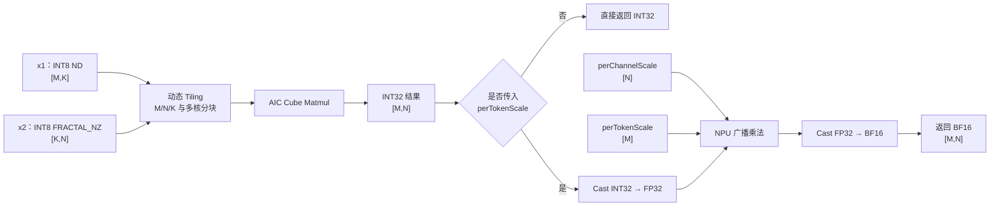

# 咕咕嘎嘎团队实践报告

## 一、团队信息与贡献说明

### 1.1 团队基本信息

- 团队标识（组号）：咕咕嘎嘎
- CANNJudge 提交账号：[@ab15245366786](https://gitcode.com/ab15245366786)
- CANNJudge 提交结果或链接：[cann-launch-camp PR #347](https://gitcode.com/cann/cann-launch-camp/pull/347)
- 实践课题：自定义量化 A8W8 Matmul 算子开发并接入 Qwen3-8B
- 目标平台：Ascend 910B
- 软件环境：CANN 9.0、PyTorch 2.8.0、torch_npu 2.8.0.post4

### 1.2 团队成员分工与贡献

| 姓名 | GitCode 账号 | 负责模块/任务分工 | 实际贡献说明 | 对应 commit hash |
| --- | --- | --- | --- | --- |
| 李秀杰 | [@ab15245366786](https://gitcode.com/ab15245366786) | Tiling 设计、Cube Kernel 与 Host 接口 | 完成 `QmmCustomTilingData` 设计，配置 A/B/C 的数据类型与存储格式，调用 Matmul Tiling API 生成多核分块参数；实现 INT8×INT8→INT32 的 Cube 计算路径、Torch 自定义算子注册与输入检查。 | `0e5b012e580ce1b8a383f41daab95a763e1f8ec9` |
| LIANG ZOU YEE LAM | [@Wistariafufum_79](https://gitcode.com/Wistariafufum_79) | 精度测试、Profiler 与模型接入 | 设计 12 组不同 M/K/N 的单算子测试，完成 INT32 与 BF16 参考结果比对；整理单算子 Profiler 数据；将 `QmmCustom` 接入 Qwen3-8B 的 W8A8 Linear 路径并验证模型推理输出。 |  |
| NOHJIHYUN | [@2501_91734977](https://gitcode.com/2501_91734977) | 环境编译、模型验证与结果分析 | 完成 CANN 环境加载、依赖安装和算子编译流程整理；执行普通推理与 Profiling 推理，汇总模型 decode 耗时；参与问题排查、实验结论整理和团队实践报告撰写。 |  |

> 有效贡献可以包括算子代码、Tiling、测试、性能优化、Notebook 或报告内容。纯合并、空提交或仅修改格式不计为有效贡献。禁止多人共用同一个 GitCode 账号提交。

### 1.3 团队协作说明

团队按照“算子实现—功能验证—模型集成与总结”的流程拆分任务。李秀杰负责算子主体，先确定输入输出规格、TilingData 字段和 Matmul Tiling 配置，再完成 INT32 Cube 路径及 Torch 接口；LIANG ZOU YEE LAM 在算子可编译后构建多种 shape 的精度测试和 Profiler 流程，并负责替换模型中的量化 Matmul 调用；NOHJIHYUN 负责统一环境、编译和模型推理流程，整理性能数据及报告材料。

集成阶段首先验证动态库能够正常加载，再分别对 INT32、BF16 两条路径逐组检查 shape、dtype 和数值误差。单算子测试通过后，团队再修改模型调用点。模型接入采用可备份、可重复执行的替换方式，完成普通推理后再开启 Profiler，避免在功能尚未稳定时直接分析性能。

最终由三名成员共同检查实验数据、实现说明和结论口径，确保报告内容与 Notebook 运行记录保持一致。

## 二、结果展示

### 2.1 单算子精度比对结果

测试覆盖 Qwen3-8B 中具有代表性的 decode、小批量和大矩阵场景。INT32 路径使用精确匹配，即 `rtol=0`、`atol=0`；BF16 路径考虑浮点乘法和 BF16 舍入误差，使用 `rtol=0.01`、`atol=0.01`。

参考计算公式如下：

```text
INT32 输出 = x1_int8 @ x2_int8
BF16 输出  = BF16(FP32(INT32 输出) × perChannelScale × perTokenScale)
```

| 序号 | 测试规格 | INT32 结果 | BF16 结果 |
| ---: | --- | :---: | :---: |
| 1 | M=1, K=4096, N=4096 | PASS | PASS |
| 2 | M=1, K=4096, N=6144 | PASS | PASS |
| 3 | M=1, K=4096, N=24576 | PASS | PASS |
| 4 | M=1, K=12288, N=4096 | PASS | PASS |
| 5 | M=50, K=4096, N=4096 | PASS | PASS |
| 6 | M=50, K=4096, N=6144 | PASS | PASS |
| 7 | M=50, K=4096, N=24576 | PASS | PASS |
| 8 | M=50, K=12288, N=4096 | PASS | PASS |
| 9 | M=4096, K=4096, N=4096 | PASS | PASS |
| 10 | M=4096, K=4096, N=6144 | PASS | PASS |
| 11 | M=4096, K=4096, N=24576 | PASS | PASS |
| 12 | M=4096, K=12288, N=4096 | PASS | PASS |

汇总结果：INT32 为 **12/12 通过**，BF16 为 **12/12 通过**。输出 shape 和 dtype 均符合算子规格，说明自定义 Cube 计算与 Scale 广播反量化逻辑在所测试的 shape 上功能正确。

### 2.2 单算子性能测试结果

以下数据来自 `torch_npu.profiler` 导出的 `kernel_details.csv`。Duration 表示 `QmmCustom` 自定义 Cube Kernel 的执行时间。

| 测试规格 | QmmCustom Cube Duration（μs） |
| --- | ---: |
| M=1, K=4096, N=4096 | 134.980 |
| M=1, K=4096, N=6144 | 202.160 |
| M=1, K=4096, N=24576 | 890.980 |
| M=1, K=12288, N=4096 | 397.380 |
| M=50, K=4096, N=4096 | 143.760 |
| M=50, K=4096, N=6144 | 214.240 |
| M=50, K=4096, N=24576 | 951.560 |
| M=50, K=12288, N=4096 | 481.580 |
| M=4096, K=4096, N=4096 | 6513.360 |
| M=4096, K=4096, N=6144 | 10029.660 |
| M=4096, K=4096, N=24576 | 41162.580 |
| M=4096, K=12288, N=4096 | 20460.440 |

从结果可以看出，M=1 和 M=50 的 decode 及小批量场景延迟较低；随着 M、K、N 增大，计算量和 Kernel 执行时间相应上升。

需要特别说明的是，当前 BF16 路径由自定义 INT32 Cube Kernel 加 NPU 上的 Cast/Mul 后处理组成。`kernel_details.csv` 中的 `QmmCustom` 记录只代表 Cube 计算部分，不能直接当作 BF16 路径的端到端耗时。后续进行性能分析时，应同时使用 NPU Event 测量完整调用，避免混淆两种统计口径。

### 2.3 算子接入模型性能测试结果

自定义算子通过 `torch.ops.ascendc_ops.qmm_custom` 替换 `CompressedTensorsW8A8Int8LinearMethod` 中的 `torch_npu.npu_quant_matmul`。

接入后，Qwen3-8B 能够正常完成推理，并生成与 attention 定义相关的连贯英文回答，说明自定义算子的模型接入链路已经打通。

| 场景 | Decode 平均耗时 | 功能结果 |
| --- | ---: | --- |
| 自定义算子普通推理 | 94.73 ms | 模型正常生成文本 |
| 自定义算子开启 Profiler | 94.68 ms | 模型正常生成文本并产生 Profiling 数据 |

两次结果仅相差 0.05 ms，可视为运行波动范围内的接近结果，说明开启本次 Profiler 后没有观察到明显的平均 decode 时间偏移。

由于当前实验记录中缺少同一硬件、同一输入和同一配置下的内置 `npu_quant_matmul` 基线，因此本报告只说明自定义算子接入成功及其当前耗时，**不能据此得出相对内置算子已经实现加速的结论**。

## 三、方案说明

### 3.1 设计思路

#### 3.1.1 算子规格

QmmCustom 接收以下输入：

- INT8 激活矩阵 `x1[M, K]`；
- FRACTAL_NZ 格式的 INT8 权重矩阵 `x2[K, N]`；
- FLOAT32 类型的 `perChannelScale[N]`；
- 可选的 FLOAT32 类型 `perTokenScale[M]`。

算子的输出规则如下：

- 未传入 `perTokenScale`：输出 INT32 类型的矩阵乘结果；
- 传入 `perTokenScale`：输出完成两级 Scale 反量化后的 BF16 结果。

#### 3.1.2 TilingData 设计

TilingData 的核心字段如下：

| 字段 | 作用 |
| --- | --- |
| `TCubeTiling cubeTilingData` | 保存 Matmul 的 M/N/K、baseM/baseN/baseK、singleCoreM/singleCoreN、usedCoreNum 等分块和多核参数 |
| `uint32_t workspaceSize` | 保存算子运行所需的用户 workspace 大小 |

Host 侧使用 `platform_ascendc::PlatformAscendCManager` 获取 Ascend 910B 平台信息，并通过 `matmul_tiling::MatmulApiTiling` 完成以下配置：

1. A 矩阵配置为 GM、ND、INT8；
2. B 矩阵配置为 GM、FRACTAL_NZ、INT8；
3. C 矩阵配置为 GM、ND、INT32；
4. 调用 `SetShape(M, N, K)` 和 `SetOrgShape(M, N, K)` 设置实际 shape 和原始 shape；
5. 调用 `GetTiling` 生成 Cube 分块参数和使用核数。

这种设计避免针对每个固定 shape 手写 Tiling 参数，使同一算子能够覆盖 M=1、M=50 和 M=4096 等不同规模。

Host 侧还会检查 M/N/K 是否大于 0、是否超过 `uint32_t` 范围，以及 x1、x2、scale 的 shape、dtype 和 device 是否匹配，从而在启动 Kernel 前报告清晰的错误信息。

#### 3.1.3 Kernel 与反量化实现

INT32 路径使用 AscendC Matmul 高阶 API，主要流程如下：

1. 将 x1、x2 和 y 绑定为 GM GlobalTensor；
2. 在 AIC 上初始化 Matmul 对象；
3. 通过 `SetTensorA`、`SetTensorB` 设置输入；
4. 调用 `IterateAll` 完成多核矩阵乘，并将 INT32 输出写回；
5. 调用 `End` 结束 Matmul 流程。

BF16 路径首先复用上述自定义 Cube Kernel 得到 INT32 结果，然后在 NPU 上将结果转换为 FP32，依次与 `[1, N]` 的 per-channel scale 和 `[M, 1]` 的 per-token scale 进行广播乘法，最后转换为 BF16。

两次乘法复用同一个 FP32 中间张量，减少一次 M×N 大小的 FP32 临时张量分配。

#### 3.1.4 Kernel 数据流



#### 3.1.5 Torch 接口与模型接入

Host 侧通过 `TORCH_LIBRARY` 声明：

```text
qmm_custom(
    Tensor x1,
    Tensor x2,
    Tensor scale,
    Tensor? pertoken_scale=None
)
```

并在 PrivateUse1 后端注册实现。

模型接入时，首先加载 `libascendc_ops.so`，然后将原 W8A8 Linear 中的量化 Matmul 调用替换为 QmmCustom。替换脚本具备首次修改前备份、唯一正则匹配、临时文件写完后原子替换，以及重复执行时不重复插入等保护。

当前算子接口不包含 bias。模型接入代码会对非空 bias 显式报错，避免在不支持的模型结构上静默生成错误结果。本次 Qwen3-8B 使用的 Linear 路径满足该约束。

### 3.2 问题解决与优化策略

#### 3.2.1 实践中遇到的问题及解决方法

1. **Notebook 工作目录不固定，仓库路径容易失效。**

   最初的流程依赖固定绝对路径，在不同算力环境中复现较为困难。团队增加了仓库根目录自动定位逻辑，同时允许通过 `CANN_LEARNING_HUB_ROOT` 显式指定路径；加载 `set_env.sh` 时避免使用不受控的 `shell=True` 字符串拼接。

2. **Torch 与 torch_npu 版本必须匹配。**

   依赖安装时曾出现 torchvision 与 Torch 版本冲突提示。团队以课程 requirements 中的 Torch 和 torch_npu 版本组合为准，并在依赖更新后重启 Kernel，避免旧模块继续驻留在 Notebook 进程中。

3. **权重必须使用 FRACTAL_NZ 格式。**

   如果直接将 ND 权重传给 Cube 路径，权重存储布局会与 Tiling 配置不一致。测试和模型接入均通过 `torch_npu.npu_format_cast(..., 29)` 或模型已有的内部格式，确保权重布局正确。

4. **BF16 Profiler 结果口径容易判断错误。**

   BF16 路径内部会先调用一次 INT32 QmmCustom，再执行 Cast/Mul。因此，Profiler 中 `QmmCustom` 行的输出类型仍然是 INT32，不能按照调用上下文直接将其标记为 BF16 Duration。团队将 QmmCustom Cube Kernel Duration 与 BF16 端到端 NPU Event 时间分开统计。

5. **模型源码替换不够稳健。**

   依赖整段字符串的替换容易受到缩进和代码版本差异影响，也可能重复插入动态库加载语句。团队改用唯一正则匹配，并增加备份、替换次数检查、结果断言和原子写入机制。

6. **大 shape 精度测试耗时和内存占用较高。**

   原测试流程为 INT32 与 BF16 分别生成输入，并各自执行一次 CPU 参考 GEMM。优化后，同一 shape 共用随机输入和一次 INT32 参考 GEMM，再由该结果生成 BF16 参考值，从而减少重复计算。

#### 3.2.2 AI 辅助使用说明

团队在本次实践中使用 AI 辅助完成了以下工作：

- 梳理 A8W8 计算公式以及 per-channel/per-token Scale 的广播关系；
- 检查 Tiling、Host 封装、测试和 Profiler 代码中的潜在边界问题；
- 发现 BF16 Profiler 被错误归类为独立 QmmCustom Kernel 数据的问题；
- 建议增加 shape、dtype、device、动态库和模型权重路径检查；
- 重构可复现测试、幂等模型替换逻辑和性能结果展示；
- 协助整理团队报告结构、数据表格和实验结论。

AI 提供的建议也存在一定风险。例如，设备端 API 可能随 CANN 版本变化，未在 Ascend 环境中编译的 Kernel 修改不能只依靠静态分析确认；自动重构还可能导致 Notebook 代码与已保存的输出不一致。

团队没有直接采用未经验证的“融合加速”代码，而是通过以下方式对 AI 生成或建议的内容进行检查：

1. 对 Notebook JSON 结构和 Python 单元进行静态语法校验；
2. 对 12 组 shape 同时比较 INT32 和 BF16 的 CPU 参考结果；
3. 重新编译动态库并加载 Torch 自定义算子；
4. 在模型中执行普通推理和 Profiling 推理；
5. 检查性能结论的统计口径，不把缺少基线的数据描述为加速结果。

本次 AI 使用的主要体会是：AI 更适合帮助发现遗漏、解释 API 和整理验证流程，不能代替目标硬件上的编译、精度测试和性能实测。对于算子开发，任何看似合理的优化都必须以编译成功、精度通过和同条件基准测试为最终依据。

#### 3.2.3 性能优化策略及效果

本次已经落实的优化主要集中在工程效率和内存开销方面：

- 通过动态 Tiling 让不同 M/N/K 共用同一实现，充分使用 `usedCoreNum` 指定的核数；
- x2 使用 FRACTAL_NZ 布局，匹配 Cube 的高效输入格式；
- BF16 反量化使用原地广播乘法，减少一个 M×N 大小的 FP32 临时张量；
- INT32/BF16 精度测试共用输入和参考 GEMM，减少重复 CPU 计算和内存分配；
- 性能测试增加 warmup，并按照 Kernel 与端到端两种口径分别统计。

这些修改改善了测试复现性和峰值内存使用，但当前实验没有相同配置下的内置算子基线，因此不能量化为“相对性能提升百分比”。

后续的优化方向包括：

1. 将 BF16 反量化移动到 AIV，构建真正的单 Kernel Cube+Vector 融合；
2. 使用 AIC/AIV 跨核同步和双缓冲，使 Matmul 与 Vector 后处理形成流水；
3. 针对 M=1、M=50 和大 M 场景分别搜索 baseM/baseN/baseK 与遍历方向；
4. 在固定输入、固定 warmup 和多次重复的条件下，对比内置算子并报告均值、P50 和 P95；
5. 结合 PipeUtilization、L2 Cache 和内存带宽指标确定瓶颈，而不是只观察总时延。

## 四、收获与感悟

### 李秀杰

本次实践让我把课堂中分散学习的 Tiling、Cube 编程和 Torch 扩展串成了一条完整链路。以前对 Tiling 的理解更多停留在“把数据切块”，实际实现后才认识到，它同时决定核间负载、核内缓存使用和不同 shape 的通用性。

通过配置 A/B/C 的位置、格式和数据类型，并观察 `baseM`、`baseN`、`baseK` 和 `usedCoreNum`，我对 Matmul 高阶 API 如何映射到 AI Core 有了更具体的认识。最大的收获是养成了先检查输入契约、再启动 Kernel 的习惯；算子报错越靠近 Host 输入端，问题越容易定位。

### LIANG ZOU YEE LAM

我主要负责精度、性能测试和模型接入。实践中体会最深的是，“测试通过”和“性能结论成立”是两件不同的事。BF16 路径虽然数值正确，但 Profiler 中只看到 INT32 QmmCustom Kernel；如果不分析完整调用链，很容易将 Cube 时间误写为 BF16 端到端时间。

通过构造不同 M/K/N 的测试、明确整数和浮点容差，并将单算子验证扩展到 Qwen3-8B 推理，我更加理解了算子测试需要同时关注数值、shape、dtype、格式和真实模型调用方式。

### NOHJIHYUN

我负责环境编译、模型推理和结果整理。整个流程让我认识到，自定义算子不仅包括 Kernel 代码，还包括环境变量、依赖版本、动态库加载、模型配置、结果目录和 Profiling 数据解析。任何一个环节不一致，都可能表现为“算子有问题”。

通过整理可重复的执行顺序和检查项，我学习了如何从编译日志、模型输出和 CSV 性能数据中逐层定位问题。报告撰写也让我意识到，性能数据必须注明测试条件和统计口径；在缺少对照实验时，如实说明实验边界比给出不可靠的加速结论更加重要。