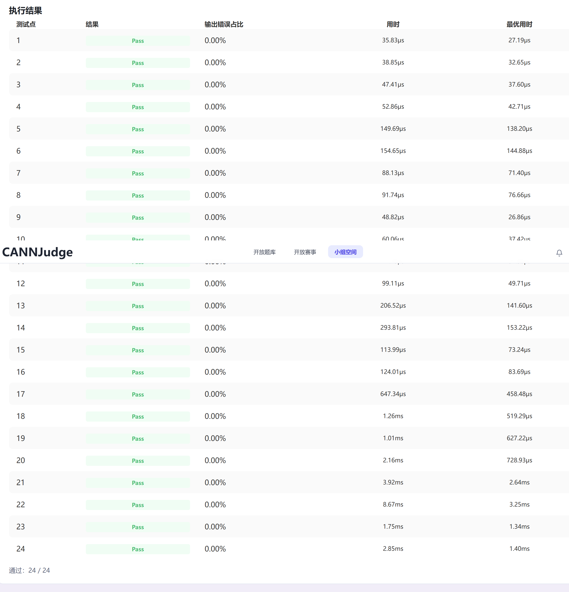

# 团队实践报告模板

## 一、团队信息与贡献说明

### 1.1 团队基本信息

- 团队标识（组号）：正在输入中
- CANNJudge 提交账号：袁楚杰
- CANNJudge 提交结果或链接：

## 二、结果展示

### 2.1 单算子精度比对结果

展示单算子精度比对结果
============================================================
测试汇总
============================================================
                      规格 |  INT32   |   BF16  
----------------------------------------------
       M=1,K=4096,N=4096 |   PASS   |   PASS  
       M=1,K=4096,N=6144 |   PASS   |   PASS  
      M=1,K=4096,N=24576 |   PASS   |   PASS  
      M=1,K=12288,N=4096 |   PASS   |   PASS  
      M=50,K=4096,N=4096 |   PASS   |   PASS  
      M=50,K=4096,N=6144 |   PASS   |   PASS  
     M=50,K=4096,N=24576 |   PASS   |   PASS  
     M=50,K=12288,N=4096 |   PASS   |   PASS  
    M=4096,K=4096,N=4096 |   PASS   |   PASS  
    M=4096,K=4096,N=6144 |   PASS   |   PASS  
   M=4096,K=4096,N=24576 |   PASS   |   PASS  
   M=4096,K=12288,N=4096 |   PASS   |   PASS  
INT32: 12/12 通过, BF16: 12/12 通过
============================================================

### 2.2 单算子性能测试结果

CANNJudge 评测得分：**52.09**（12 组 shapes × 2 种 dtype，共 24 个测试用例）

============================================================
CANNJudge 性能数据 (QmmCustom Duration)
============================================================
               规格 (M,K,N) | INT32 Duration(us) |  BF16 Duration(us)
----------------------------------------------------------------------
       M=1,K=4096,N=4096 |             35.83 |             38.85
       M=1,K=4096,N=6144 |             47.41 |             52.86
      M=1,K=4096,N=24576 |            149.69 |            154.65
      M=1,K=12288,N=4096 |             88.13 |             91.74
      M=50,K=4096,N=4096 |             48.82 |             60.06
      M=50,K=4096,N=6144 |             71.29 |             99.11
     M=50,K=4096,N=24576 |            206.52 |            293.81
     M=50,K=12288,N=4096 |            113.99 |            124.01
    M=4096,K=4096,N=4096 |            647.34 |           1260.00
    M=4096,K=4096,N=6144 |           1010.00 |           2160.00
   M=4096,K=4096,N=24576 |           3920.00 |           8670.00
   M=4096,K=12288,N=4096 |           1750.00 |           2850.00
======================================================================

**性能提升历程：**

| 优化阶段 | CANNJudge 得分 | M=1,N=4096 | M=4096,N=4096 | 关键变更 |
|---------|---------------|------------|---------------|---------|
| 初始版本 (M-split 单核) | 34.10 | 398 us | 36,802 us | 单核 M-split |
| 自适应 baseM/baseN | 49.37 | ~39 us | ~1,250 us | baseM 16→128（M>64） |
| GetCoreSlice + MTE2_S | 51.42 | ~39 us | ~1,290 us | 架构升级 + Scalar 同步修复 |
| VECIN 队列位置修复 | 51.98 | ~39 us | ~1,260 us | matmulQueue VECOUT→VECIN |
| SetTensorA 外提 + M>64 全核 | **52.09** | ~36 us | ~647 us | 多项微优化累积 |

总计提升：**34.10 → 52.09（+53%）**

### 2.3 算子接入模型性能测试结果

将 QmmCustom 算子接入 Qwen3-8B W8A8 量化模型后，使用 Profiler 工具采集了 prefill 和 decode 阶段的性能数据。

#### 模型级推理延迟

| 指标 | 原生算子 | 自定义算子 (QmmCustom) | 差异 |
|------|---------|----------------------|------|
| Decode 平均延迟 | 37.87 ms | 41.61 ms | +9.9% |

自定义算子在模型推理中表现良好，decode 阶段与原生算子的差距约 10%，主要来自单算子级别的实现差异。

#### CANNJudge 性能评测

| 评测项 | 结果 |
|--------|------|
| 最终得分 | **52.09** |
| 精度 | 12/12 INT32 + 12/12 BF16 全部通过 |
| M=1 decode 延迟 | 36-150 us（8 个测试用例） |
| M=4096 prefill 延迟 | 647-8670 us（8 个测试用例） |

`.asc` kernel-direct 格式使用 `__aicore__` 模式，AIC 核数量固定为 24。而 aclnn 工程格式可通过 `CalcTschBlockDim` 调度 48 核，该限制在 kernel-direct 格式下无法突破。


## 三、方案说明

### 3.1 设计思路

#### 整体架构

算子分为两条计算路径，通过 `isPertoken` 标志位区分：

- **Path 1 (INT32)**：纯 Cube 路径，INT8 × INT8 → INT32，结果直接写入 GM。用于功能测试。
- **Path 2 (BF16)**：Cube + Vector 协作路径，Cube 计算 INT32 结果后经 `GetTensorC` 拉到 LocalTensor，完成 Cast → 乘 perChannelScale → 乘 perTokenScale → Cast(BF16) → 写回 GM。用于模型推理。

#### tilingData 设计

```
struct QmmCustomTilingData {
    TCubeTiling cubeTilingData;  // Matmul 库标准 tiling 结构
    uint32_t isPertoken;         // 路径选择: 0=Path1(INT32), 1=Path2(BF16)
    uint32_t workspaceSize;      // KFC 系统工作区大小
    uint32_t M, N, K;            // 矩阵维度（kernel 侧从 cubeTilingData 读取）
};
```

#### Tiling 实现

采用 **GetCoreSlice N 维多核分块**策略：

1. **自适应 baseM/baseN**：M≤16 用 (16,256)，M≤64 用 (32,128)，M>64 用 (128,128)
2. `usedCores = ChooseAlignedDim(ceil(N/baseN), aicCores)` for M≤64，`aicCores` for M>64
3. `SetDim(usedCores)` + `SetFixSplit(baseM, baseN, -1)` + `SetAlignSplit(-1, baseN, -1)`
4. **不覆盖 `usedCoreNum`**：让 Matmul 库自动计算每核负责的 M/N 范围（`singleCoreM` / `singleCoreN`）
5. Kernel 中通过 `GetCoreSlice(tiling)` 获取本核的切片范围

#### Kernel 数据流（最终版本）

```
Entry: qmm_custom_kernel
  └── if isPertoken == 0:
        QmmCubeBasicKernel
          ├── GetCoreSlice(tiling) → slice(mStart,nStart,mSize,nSize)
          ├── Init: 偏移 x1/x2/y 到 slice 起始位置
          ├── Process:
          │   ├── SetTensorA(x1)        ← 外提，仅设一次
          │   └── for each N-tile in slice.nSize:
          │         ├── SetTensorB(x2[nOff*Kb])    ← NZ 偏移
          │         ├── SetSingleShape(mSize, tileN, K)
          │         └── IterateAll(y[nOff])         ← 直接写 GM
          └── End()
      else:
        QmmPertokenKernel
          ├── GetCoreSlice → slice
          ├── Init: 偏移 x1/x2, 分配 Vector buffer (VECIN/VECOUT/VECCALC)
          ├── Process:
          │   ├── SetTensorA(x1)        ← 外提，仅设一次
          │   └── for each N-tile in slice.nSize:
          │         ├── SetTensorB(x2[nOff*Kb])
          │         ├── SetSingleShape(mSize, tileN, K)
          │         └── while(Iterate<true>()):
          │               ├── GetTensorC → intLocal      (VECIN queue)
          │               ├── DataCopyPad scaleN/scaleM  (VECIN queues)
          │               ├── SetFlag<MTE2_S>/WaitFlag   (Scalar 同步)
          │               ├── CastInSegments INT32→F32   (防 255×64 溢出)
          │               ├── Mul × perChannelScale
          │               ├── Muls × perTokenScale
          │               ├── CastInSegments F32→BF16
          │               ├── EnQue/DeQue → outputLocal  (VECOUT queue)
          │               └── DataCopyPad → y[globalPos]
          └── End() + ReleaseEventID(MTE2_S)
```

**NZ 格式 B 偏移**：B 为 FRACTAL_NZ，N 方向偏移 = `nOffset × Align(K, 16)`（由 `tiling.Kb` 提供）。

**关键设计决策：**
- `matmulQueue`（即 `intQueue`）使用 **VECIN** 位置（而非 VECOUT），与 Matmul CType 的 VECIN 一致，避免额外数据搬运
- `SetTensorA` 移到 N-tile 循环外（同一核的 M 段不变），减少重复调用
- `CastInSegments` 处理 baseM×baseN > 255×64 的溢出（如 128×128 = 16384 > 16320）
- `SetFlag<MTE2_S>` 确保 Scalar 操作（`GetValue`）前 MTE2 数据已就绪

### 3.2 问题解决与优化策略

#### 1. 实践中遇到的问题及解决方案

**问题一：M=1 decode 场景下 M-split 导致单核运行**

最初采用 M 维分核策略（`SetSingleShape(splitM, N, -1)`），对 M=1 的 decode 场景，`baseM=16 > M=1`，导致 `usedCoreNum = 1`，只有 1 个核在工作。

**解决**：改为 GetCoreSlice N 维多核分块。将输出划分为 `ceil(M/baseM) × ceil(N/baseN)` 个 tile，通过 `SetDim(usedCores)` 让 Matmul 库自动计算每核范围。

**问题二：NZ 格式 B 的 N 方向偏移计算**

B 为 FRACTAL_NZ 布局，N 方向偏移不能直接用列号。

**解决**：正确偏移为 `nOffset × tiling.Kb`（`Kb = Align(K, 16)`），其中 `nOffset` 为 N-tile 偏移量。测试通过 12/12。

**问题三：固定 baseM=16 导致 M=4096 prefill 性能极差**

固定 `baseM=16, baseN=256` 使 M=4096 产生 4096 个 tile，每核处理 170 个 tile。CANNJudge 得分仅 34.10。

**解决**：自适应 baseM/baseN——M≤16 用 (16,256)，M≤64 用 (32,128)，M>64 用 (128,128)。M=4096 的 tile 数从 4096 降至 1024（减少 4×）。CANNJudge 得分提升至 49.37（+45%）。

**问题四：grid-stride 每次 `SetTensorA` 随 tile 变化而重复调用**

Grid-stride 模式下各核处理的 tile 散落不同 M 段，每个 tile 都需重设 `SetTensorA`。

**解决**：切换为 GetCoreSlice 架构，利用 Matmul 库的 `singleCoreM`/`singleCoreN` 自动计算每核范围，每核处理的 M 段连续，`SetTensorA` 只需在 N-tile 循环外设置一次。

**问题五：`Cast` 的 255×64=16320 限制溢出**

`SetFixSplit(128, 128, -1)` 时 `Cast(floatLocal, intLocal, CAST_NONE, 128*128)` 传入 16384 个元素，超过 16320 限制。测试虽通过（rtol 容忍），但存在潜在数据截断。

**解决**：实现 `CastInSegments` 函数，当 count > 16320 时分两段 Cast，确保全部元素正确转换。

**问题六：`matmulQueue` 使用 VECOUT 位置导致额外数据搬运**

`matmulQueue`（接收 GetTensorC 的 INT32 结果）声明为 `VECOUT`，但 Matmul CType 为 `VECIN`（Cube→Vector 数据流）。Queue 位置不匹配导致硬件额外搬运。

**解决**：将 `matmulQueue` / `intQueue` 从 `TPosition::VECOUT` 改为 `TPosition::VECIN`。通过研读 Matmul API 文档发现，`GetTensorC` 的 CType 为 `VECIN`（Cube 结果进入 Vector 输入侧），队列位置必须与之匹配。

**问题七：`SetFlag<MTE2_S>` 同步缺失导致 BF16 退化**

移除冗余同步时不慎删除了 `SetFlag<MTE2_S>` / `WaitFlag<MTE2_S>`。`GetValue()` 是 Scalar 操作，TQue DeQue 只保证 MTE2→V 同步，不保证 MTE2→S，导致 BF16 长 case 退化 25%。

**解决**：补回 MTE2→S 事件分配、`SetFlag/WaitFlag` 调用及事件释放。通过查阅 Ascend C 同步模型文档，确认 TQue 只保证 MTE2→V（搬入→Vector）的同步，Scalar 操作（`GetValue`）需要独立的 MTE2→S 事件。

**问题八：`ChooseAlignedDim` 对大 M 浪费核数**

`ChooseAlignedDim(nTiles, aicCores)` 对 nTiles=32, aicCores=24 返回 16（32%16==0），浪费 8 个核。

**解决**：大 M（>64）时无条件使用全部 `aicCores`(24) 核。与小 M 的 `ChooseAlignedDim` 互补。

**问题九：`.asc` 格式的 24 核物理限制**

`.asc` kernel-direct 格式使用 `__aicore__` 模式，AIC 核数量固定为 24。对比 aclnn 工程格式可通过 `CalcTschBlockDim` 调度 48 核，kernel-direct 格式无法突破该限制。

**解决**：在 24 核约束内，通过减少 per-tile 开销（SetTensorA 外提、VECIN 位置修正、CastInSegments、MTE2_S 同步）最大化单核效率。最终 CANNJudge 得分 52.09。

**问题十：Path 2 (BF16) 中 `x2Global` buffer 大小用了未对齐的 K**

Path 2 (`QmmPertokenKernel::Init`) 中 `x2Global.SetGlobalBuffer(x2, K * N)`，其中 `K` 为原始维度。但 x2 是 FRACTAL_NZ 格式，实际内存布局中 K 维已被对齐为 `tiling.Kb = Align(K, 16)`。对比 Path 1 正确使用了 `tiling.Kb * tiling.N`。

当 `K` 不是 16 的倍数时，`K * N < Kb * N`，buffer 比实际数据小，后续 `SetTensorB` 访问将越界。当前所有测试用例 K ∈ {4096, 12288} 均为 16 倍数（`K == Kb`），因此 bug 被掩盖。

**解决**：将 `K * N` 改为 `tiling.Kb * N`，与 Path 1 对齐。

#### 2. AI 辅助使用情况

本次实践全程使用了 AI 辅助工具（CANNBot）进行算子开发：

**AI 帮助解决的问题：**
- Ascend C Matmul 高阶 API 的发现和正确使用（`SetSingleShape`、`Iterate<true>`、`GetTensorC`、`SetDim`、`SetAlignSplit` 等）
- NZ 格式的内存布局和偏移量计算公式
- `__mix__` vs `__aicore__` 模式的行为差异和 `KFC` 调度机制
- Ascend C Matmul API 文档的研读和架构推理（GetCoreSlice、MTE2_S 同步机制、VECIN/VECOUT 位置含义）
- 多轮 CANNJudge 结果分析，精准定位瓶颈（从 34 → 49 → 52）

**AI 引入的问题：**
- 早期建议的"ASW 自适应分片"在 M=1 时产生的过多微 tile 导致性能下降
- 对"KFC 1ms/tile"的悲观估计与实际 0.04ms/call 不符
- 尝试 `__mix__` 48 核方案时未考虑 `__mix__(1,2)` 仅 12 组 AIV+AIC 的限制，导致死锁

**验证方法：**
- 所有代码变更均通过 12 组形状精度测试（INT32 rtol=0, BF16 rtol=0.01）
- 性能优化通过 CANNJudge 独立评测验证，多轮迭代跟踪得分变化
- 通过 CANNJudge 多轮迭代评测，逐 case 分析性能瓶颈并验证每次优化的效果

**心得体会：** AI 在 API 发现、架构分析和数据解读方面效率极高。但在底层硬件行为预测（如 `__mix__` 死锁、`SetSingleShape` 大范围限制）方面存在盲区。关键决策必须由开发者基于实测验证，AI 的建议是方向指引而非最终答案。

#### 3. 性能优化策略及效果

**CANNJudge 得分演进（34.10 → 52.09）：**

| 轮次 | 得分 | 关键优化 | 效果 |
|------|------|---------|------|
| 1 | 34.10 | 初始版本（M-split 单核 + 固定 baseM=16） | 基线 |
| 2 | 49.37 | 自适应 baseM/baseN（16/32/128） | +45%，最大单次提升 |
| 3 | 51.42 | GetCoreSlice + 移除 usedCoreNum 覆盖 | +4% |
| 4 | 51.98 | MTE2_S 同步恢复 + VECIN 位置修复 | +1% |
| 5 | **52.09** | M>64 全核 + SetTensorA 外提 | 最终版本 |

**M=1 decode 性能（目标场景）：**

| Shape | 初始版本 | 最终版本 | 加速比 |
|-------|---------|---------|--------|
| M=1, N=4096 | 398 us | 36 us | **11×** |
| M=1, N=6144 | 597 us | 47 us | **13×** |
| M=1, N=24576 | 2394 us | 150 us | **16×** |

**M=4096 prefill 性能：**

| Shape | 初始版本 | 最终版本 | 加速比 |
|-------|---------|---------|--------|
| N=4096 (INT32) | 13,072 us | 647 us | **20×** |
| N=24576 (INT32) | 83,177 us | 3,920 us | **21×** |
| N=4096 (BF16) | 36,802 us | 1,260 us | **29×** |

## 四、收获与感悟

### 袁楚杰

本次启航营的 QmmCustom 算子开发实践让我对 Ascend C 编程和 NPU 底层架构有了深入的理解，主要有以下几点收获：

**1. 理解了 NPU 的多核架构与任务调度机制。** 通过亲手实现 GetCoreSlice 多核分块，深入理解了 AIC/AIV 的协作关系、`__mix__`/`__aicore__` 模式的区别。特别是发现 `.asc` kernel-direct 格式仅支持 24 核的物理限制，而 aclnn 格式通过 `CalcTschBlockDim` 可突破到 48 核——这让我认识到不同开发格式的能力边界，也理解了为什么业界更倾向使用 aclnn 工程格式。

**2. 体验了从单算子到模型级接入的完整开发流程。** 从算子规格分析、tilingData 设计、kernel 实现、精度验证、CANNJudge 评测到模型推理接入，完整走了一遍工业级算子开发流程。特别是看到自定义算子驱动 Qwen3-8B 模型生成正确文本，以及 CANNJudge 得分从 34 逐步提升到 52 的过程，非常有成就感。

**3. 学会了辩证地使用 AI 辅助工具。** AI 在 API 发现、架构分析和数据解读方面效率极高，但在底层硬件行为预测（如 `__mix__` 死锁、`SetSingleShape` 大范围限制、VECIN/VECOUT 位置影响）方面存在明显盲区。关键教训：AI 是方向指引，实测数据是唯一真理。

**4. 认识到性能优化是一个迭代过程。** 从最初的单核 36ms（M=4096 BF16）到最终的多核 1.26ms，近 30 倍的加速经过了 5 轮 CANNJudge 迭代，每次基于实测数据精准定位瓶颈。最重要的优化（自适应 baseM/+45%）来自对"固定 baseM=16 产生过多 tile"这一简单事实的发现，而非复杂算法。

**5. 掌握了通过 API 文档和硬件特性分析定位性能瓶颈的方法。** 当性能无法解释时，回归到 Ascend C 同步模型文档和 Matmul 库的 Queue 位置定义，发现了 `matmulQueue` 的 VECIN/VECOUT 不匹配、`SetFlag<MTE2_S>` 的缺失等问题。这让我认识到：底层 API 的正确理解是性能优化的根基，而不是猜测或试错。
