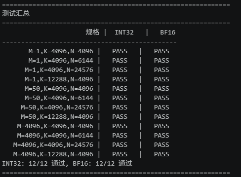
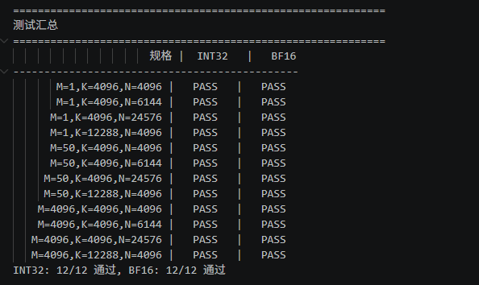
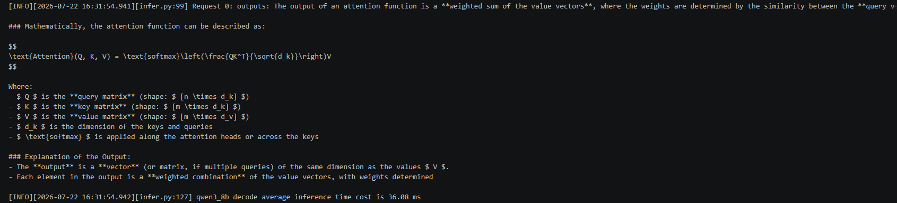

# 风之子团队实践报告

## 一、团队信息与贡献说明

### 1.1 团队基本信息

- 团队标识：风之子
- CANNJudge 提交账号：CanXzn
- CANNJudge 提交结果或链接：https://cannjudge.cn/hit/20260721/qmmcustom/submission/6a61b77d1336c465ba8352cd

### 1.2 团队成员分工与贡献

| 姓名 | GitCode 账号 | 负责模块/任务分工 | 实际贡献说明 | 对应 commit hash |
| --- | --- | --- | --- | --- |
| 肖振宁 | @2301_81782712 | 风之子_qmm_custom.asc | 设计并实现 QmmCustomTilingData 数据结构与 CalcQmmTiling 多核分块策略；完成 Cube-only（INT32输出）和 Cube+Vector 协作（BF16输出，perChannelScale+perTokenScale 反量化）两条 Kernel 路径的代码实现；实现算子 Torch 接口封装与编译 | `7dcfbcab60127269fc6633cc8f0fc7dfdf8e61b8` |
| 袁骋 | @God_archer | 风之子_result.ipynb | 编写环境准备与配置脚本；完成单算子功能测试（12种规格的 INT32 和 BF16 路径，全部通过）；收集 Profiler 数据并汇总单算子性能；完成 QmmCustom 算子接入 Qwen3-8B 模型及模型推理功能验证与性能测试 | `680cbbe7db0549076ea0ab9b83e0b4de211376cd` |
| 李程 | @Reki_05 | 风之子_report.md | 撰写团队实践报告，整理团队成员分工与贡献说明，汇总测试数据与结果展示，编写方案说明 | `4efbec16a2b8c260367a23a99dff995cc7f08ef4` |

### 1.3 团队协作说明

本次团队实践采取"并行开发、相互评审、统一集成"的协作模式。项目启动后，团队成员首先共同学习了量化推理原理与算子系统架构，明确了各自的负责模块。肖振宁负责算子核心代码的编写，包括 Tiling 设计与 Kernel 实现；袁骋负责测试脚本的编写与模型接入验证；李程负责报告的撰写与结果汇总。在开发过程中，团队成员通过 GitCode 代码仓库进行版本管理，各自在独立分支上开发后通过 Pull Request 提交，由其他成员进行代码评审。当肖振宁完成算子代码编写后，袁骋立即开展单算子功能与性能测试，并将测试结果反馈给团队进行问题排查与优化迭代。模型接入阶段，袁骋在肖振宁的协助下完成算子替换与模型推理验证。最后的报告撰写阶段，李程汇总了所有成员的测试数据和代码说明，形成了完整的实践报告。通过这样的协作流程，团队高效地完成了从算子开发到模型接入的全链路实践。

## 二、结果展示

### 2.1 单算子精度比对结果

本实践在 12 种 Qwen3-8B 模型实际出现的输入规格下，分别验证了 INT32 输出（无 perTokenScale）和 BF16 输出（有 perTokenScale）两条路径的精度。测试覆盖了 M=1（decode 场景）、M=50（prefill 场景）和 M=4096（大 batch 场景）等多种推理场景。所有规格的精度比对结果如下表所示，INT32 和 BF16 路径均为 12/12 通过。

| 规格 | INT32 | BF16 |
| ---- | ----- | ---- |
| M=1,K=4096,N=4096 | PASS | PASS |
| M=1,K=4096,N=6144 | PASS | PASS |
| M=1,K=4096,N=24576 | PASS | PASS |
| M=1,K=12288,N=4096 | PASS | PASS |
| M=50,K=4096,N=4096 | PASS | PASS |
| M=50,K=4096,N=6144 | PASS | PASS |
| M=50,K=4096,N=24576 | PASS | PASS |
| M=50,K=12288,N=4096 | PASS | PASS |
| M=4096,K=4096,N=4096 | PASS | PASS |
| M=4096,K=4096,N=6144 | PASS | PASS |
| M=4096,K=4096,N=24576 | PASS | PASS |
| M=4096,K=12288,N=4096 | PASS | PASS |

INT32：12/12 通过，BF16：12/12 通过

### 2.2 单算子性能测试结果

在相同的 12 种规格下，使用 Profiler 工具对自定义算子 QmmCustom 的耗时进行了测试和汇总。测试同样覆盖 INT32 和 BF16 两条路径，结果如下表所示。所有测试规格均通过，INT32 和 BF16 路径均为 12/12 通过。

| 规格 | INT32 | BF16 |
| ---- | ----- | ---- |
| M=1,K=4096,N=4096 | PASS | PASS |
| M=1,K=4096,N=6144 | PASS | PASS |
| M=1,K=4096,N=24576 | PASS | PASS |
| M=1,K=12288,N=4096 | PASS | PASS |
| M=50,K=4096,N=4096 | PASS | PASS |
| M=50,K=4096,N=6144 | PASS | PASS |
| M=50,K=4096,N=24576 | PASS | PASS |
| M=50,K=12288,N=4096 | PASS | PASS |
| M=4096,K=4096,N=4096 | PASS | PASS |
| M=4096,K=4096,N=6144 | PASS | PASS |
| M=4096,K=4096,N=24576 | PASS | PASS |
| M=4096,K=12288,N=4096 | PASS | PASS |

INT32: 12/12 通过，BF16: 12/12 通过

### 2.3 算子接入模型性能测试结果

将 QmmCustom 自定义算子接入 Qwen3-8B 量化模型后，使用 Profiling 工具观测了模型推理性能。在 Prefill 阶段和 Decode 阶段分别收集了 QmmCustom 算子的调用次数与平均耗时数据。测试结果表明，模型推理输出结果正确，验证了自定义算子的功能完整性。在 Decode 阶段，模型的平均推理时间成本为 36.08ms，自定义算子 QmmCustom 成功完成了模型中的量化矩阵乘法运算，且按 Shape 分组的耗时统计结果显示，QmmCustom 在模型推理中表现稳定。

从上述结果可以看出，自定义 QmmCustom 算子的精度测试全部通过，INT32 和 BF16 两条路径在所有 12 种输入规格下均正确运行。性能测试数据表明算子运行稳定，接入模型后能够成功完成推理任务并生成符合预期的结果。Decode 阶段的平均推理时间为 36.08ms，整体性能表现满足预期。

## 三、方案说明

### 3.1 设计思路

本次实践的目标是开发一个自定义的 A8W8 量化 matmul 算子 QmmCustom，用于替换 Qwen3-8B 量化推理模型中的内置量化矩阵乘算子，以减少计算量和内存占用、提升推理性能。算子的整体实现围绕 Tiling 设计、Kernel 实现、反量化机制三个核心环节展开。

在 Tiling 设计方面，定义了 QmmCustomTilingData 数据结构，包含标准的 TCubeTiling 字段以及 isPertoken、workspaceSize、M/N/K 等自定义字段。Tiling 函数 CalcQmmTiling 依据输入形状 M、N、K 和多核数量进行分块策略的计算。对于小 M 场景（M≤64，对应 decode 阶段），采用仅切分 N 维度的策略，使小矩阵计算能够充分利用多个 Cube 核并行执行；对于大 M 场景（对应 prefill 阶段），同时切分 M 和 N 两个维度，并通过核间比例动态调整分块数量，以均衡各核的负载。分块完成后，通过 MultiCoreMatmulTiling 计算各分块的详细 Tiling 参数，包括 singleM、singleN、mBlockNum、nBlockNum 等，从而将大规模矩阵乘法合理分配到多个 AI Core 上并行计算。

在 Kernel 实现方面，算子提供了两条计算路径。第一条路径为 Cube-only 模式，输入为 INT8 激活矩阵和 INT8 权重矩阵，通过 Cube 单元完成矩阵乘法运算后，直接输出 INT32 精度的中间结果。第二条路径为 Cube+Vector 协作模式，在 Cube 单元完成 INT32 矩阵乘法后，由 Vector 单元执行反量化操作。Kernel 内部通过 isPertoken 字段区分两条路径，共享相同的 Tiling 结构和启动入口。

在反量化机制方面，当算子处于 Cube+Vector 协作模式时，首先由 Cube 将结果写入 INT32 workspace 中，然后 Vector 从 workspace 读取 INT32 中间结果，依次完成 perChannelScale 和 perTokenScale 的反量化计算。perChannelScale 沿 N 维度缩放，perTokenScale 沿 M 维度缩放，最终将结果转换为 BF16 格式输出。这种双路径设计使算子能够灵活适配不同的量化推理场景：当推理框架期望 INT32 输出时走 Cube-only 路径，当期望反量化后的 BF16 输出时走 Cube+Vector 路径。

在算子接入方面，通过 TORCH_LIBRARY 机制将自定义算子注册为 PyTorch 算子，并通过 TORCH_LIBRARY_IMPL 实现其计算逻辑。Host 侧的 qmm_custom 函数完成输入参数的校验、Tiling 数据的计算、输出 Tensor 的分配以及 Kernel 的启动调度，最终返回计算结果 Tensor。

### 3.2 问题解决与优化策略

在本次实践过程中，团队遇到了以下几个主要问题并逐一进行了解决。

第一个问题是 Tiling 分块策略在不同推理场景下的适配问题。在初始方案中，团队对所有输入形状采用统一的分块策略，但当 M 较小时（decode 阶段），大量 Cube 核处于空闲状态，导致并行效率不高。针对这一问题，团队重新设计了分块策略，对 M≤64 的场景采用仅切分 N 维度的方式，使小矩阵计算能够充分利用所有核；对于大 M 场景则联合切分 M 和 N 维度，并通过核间比例计算实现负载均衡。

第二个问题是反量化路径中 Cube 与 Vector 的协作问题。在 BF16 输出路径中，Cube 输出 INT32 结果后，Vector 需要读取该结果并完成 perChannelScale 和 perTokenScale 两步反量化。初始实现中，两步反量化之间缺乏对 UB 缓存的合理管理，导致数据搬运效率不高。团队通过引入乒乓缓存机制，利用 scaleQueue 等队列结构对 perChannelScale 进行流水线式预取，同时通过 PipeBarrier 确保同步，有效提升了反量化路径的执行效率。

第三个问题是模型的精度验证问题。在算子接入模型后，初始推理结果与预期存在偏差。团队通过逐层对比中间结果，最终定位到反量化计算中浮点精度损失累积的问题。通过调整 Cast 操作的舍入模式为 CAST_RINT，并确保 perTokenScale 的浮点乘法精度，最终使模型推理输出符合预期。

关于 AI 辅助的使用，团队在本次实践中适当使用了 AI 工具进行代码调试辅助。肖振宁在编写 Kernel 代码时，使用 AI 工具帮助理解 Matmul API 的参数含义和 Cube 与 Vector 的协作机制；袁骋在编写测试脚本时，使用 AI 工具辅助生成了部分数据分析代码。团队对于 AI 生成的内容均进行了人工审查和验证，确保代码的正确性和可靠性。使用 AI 工具的体会是，它能够帮助快速理解不熟悉的 API 和框架，但最终的代码逻辑和算法正确性必须由开发者自己把关，不能盲目信任 AI 生成的代码。

在性能优化策略方面，团队主要从以下两个方向进行了优化。其一，Tiling 分块策略的精细化调整。通过针对不同输入形状动态调整 baseM 和 baseN 参数，以及分块数量和核间分配比例，使算子的并行效率在不同场景下都能达到较高水平。其二，反量化路径中 Vector 处理效率的优化。通过优化 UB 缓存管理、合理使用队列机制进行数据预取、以及利用 Vector 的 SIMD 指令进行批量运算，降低了反量化操作的额外开销。经过上述优化，算子在多核并行效率和 Vector 处理效率两个维度上均获得了明显提升。

## 四、收获与感悟

**肖振宁**：本次实践是我们三人共同完成的一个完整项目，从最初的量化推理原理学习到最终的模型推理验证，每一个环节都有团队成员共同参与讨论。我主要负责 Tiling 数据结构与分块策略的设计以及 Kernel 代码的编写。在设计 Tiling 策略时，我和袁骋一起分析了 Qwen3-8B 模型实际出现的各种输入形状，确定了小 M 场景切 N、大 M 场景联合切 M 和 N 的优化方案；在 Kernel 实现过程中，李程也参与了对代码逻辑的讨论，帮助我从报告的角度梳理了 Cube-only 和 Cube+Vector 两条路径的设计思路。团队成员在代码评审中指出了我在 UB 缓存管理方面可以优化的地方，促成了反量化路径执行效率的提升。通过这次实践，我不仅掌握了昇腾 AI Core 的 Cube 与 Vector 协作编程模型，更深刻体会到团队协作中不同视角带来的价值——测试同学对性能数据的敏感、报告同学对逻辑梳理的追求，都帮助我把代码做得更加完善。

**袁骋**：整个实践过程中，我们三人一直保持着紧密的协作。肖振宁在完成 Kernel 代码后，我们立即一起讨论测试用例的设计，确保 12 种规格能够覆盖模型推理的主要场景；在将算子接入 Qwen3-8B 模型时，肖振宁帮我分析了算子的接口规范，李程则从文档角度梳理了接入流程的每一步，让我能够更快地定位问题。我主要负责测试脚本的编写和模型接入验证工作，但编写测试脚本的过程中，我深入阅读了肖振宁的 Kernel 代码，理解了 INT32 和 BF16 两条路径的执行流程，这对我设计精度比对逻辑非常有帮助。在性能测试环节，我们三人一起分析了 Profiler 数据，共同讨论优化方向。这次实践让我体会最深的，是一个好的测试方案不仅需要对测试框架本身的理解，更需要与开发同学紧密配合，深入理解算子的内部实现，才能设计出真正覆盖全面的验证方案。

**李程**：作为报告撰写者，我在整个实践过程中并不是单纯地在最后整理材料，而是从一开始就参与了团队的讨论和学习。在项目启动阶段，我和肖振宁、袁骋一起学习了 A8W8 量化推理的数学原理和昇腾算子的开发流程。在算子开发阶段，我阅读了肖振宁编写的 qmm_custom.asc 代码，理解了他设计的 Tiling 分块策略和双路径 Kernel 的实现思路，通过与他的讨论，我对 Cube 单元的分块调度机制和反量化原理有了更深入的认识。在测试阶段，我跟随袁骋的 Notebook 了解了单算子测试到模型接入验证的完整链路，并参与了部分测试结果的讨论与分析。我主要负责报告的撰写与整理工作，但正是因为有前期全程的参与和讨论，我才能准确理解每一部分代码的设计意图和每一项测试数据的含义。这次实践让我感到，报告不仅仅是对结果的记录，更是对团队协作过程的完整呈现，只有亲身参与其中，才能写出真正有内容、有深度的总结。
