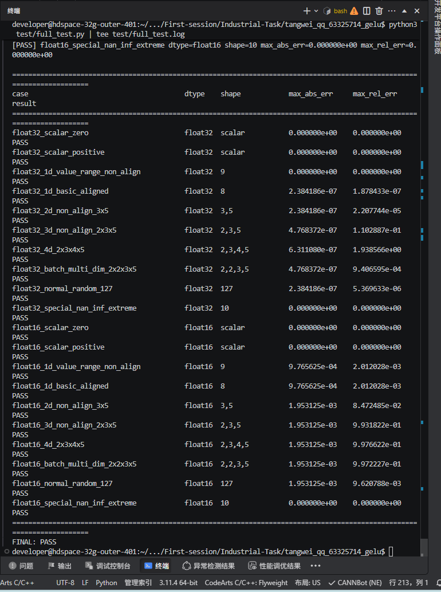

# GELU Ascend C Custom Operator

## 1. 课题说明

本项目基于 Ascend C 实现自定义 GELU 算子 `Gelu`，对标 PyTorch 原生接口：

```python
torch.nn.functional.gelu(x, approximate="none")
```

本项目完成了算子 Host 侧 Tiling、Kernel 侧计算、aclnn 接口调用测试、PyTorch golden 结果生成以及全场景精度对比验证。

---

## 2. 算子功能
GELU，全称 Gaussian Error Linear Unit，是深度学习中常用的激活函数之一。其精确表达式为：
GELU(x) = 0.5 * x * (1 + erf(x / sqrt(2)))

其中：
1 / sqrt(2) = 0.7071067811865476

本项目实现的是精确 GELU 版本，对齐 PyTorch：
torch.nn.functional.gelu(x, approximate="none")

---

## 3. 支持能力

### 3.1 数据类型覆盖

| 数据类型 | 是否支持 | 说明 |
|---|---|---|
| float32 | 支持 | 与 PyTorch `torch.nn.functional.gelu(x, approximate="none")` 对标 |
| float16 | 支持 | 与 PyTorch `torch.nn.functional.gelu(x, approximate="none")` 对标 |

### 3.2 维度场景覆盖

| 维度场景 | 示例 Shape | 是否覆盖 | 说明 |
|---|---|---|---|
| 0 维标量 | scalar | 已覆盖 | 验证单个元素输入场景 |
| 1 维 | 8、9、127 | 已覆盖 | 覆盖基础 1D 输入、非对齐输入和随机数输入 |
| 2 维 | 3,5 | 已覆盖 | 覆盖二维非 32B 对齐场景 |
| 3 维 | 2,3,5 | 已覆盖 | 覆盖三维多维 Tensor 场景 |
| 4 维 | 2,3,4,5 | 已覆盖 | 覆盖四维 Tensor 场景 |
| 含批次维度的多维场景 | 2,2,3,5 | 已覆盖 | 覆盖 batch 维度输入 |
| 非 32B 对齐场景 | scalar、9、3,5、127 | 已覆盖 | 通过 32B 对齐补齐方式解决 DataCopy 搬运问题 |

### 3.3 数值场景覆盖

| 数值场景 | 是否覆盖 | 说明 |
|---|---|---|
| 零值 | 已覆盖 | 验证 `GELU(0) = 0` |
| 小正值 | 已覆盖 | 覆盖 `0 < x < 1` |
| 中等正值 | 已覆盖 | 覆盖 `1 ≤ x < 6` |
| 大正值 | 已覆盖 | 覆盖 `x ≥ 6` |
| 小负值 | 已覆盖 | 覆盖 `-1 < x < 0` |
| 中等负值 | 已覆盖 | 覆盖 `-6 < x ≤ -1` |
| 大负值 | 已覆盖 | 覆盖 `x ≤ -6` |
| 标准正态分布随机数 | 已覆盖 | 使用随机输入验证一般分布场景 |

### 3.4 特殊值场景覆盖

| 特殊值场景 | 是否覆盖 | 说明 |
|---|---|---|
| NaN | 已覆盖 | 验证 NaN 传播行为 |
| +Inf | 已覆盖 | 验证正无穷输入行为 |
| -Inf | 已覆盖 | 验证负无穷输入行为 |
| 极大正值 | 已覆盖 | 验证大正数输入下的数值稳定性 |
| 极小负值 | 已覆盖 | 验证大负数输入下趋近于 0 的行为 |

---

## 4. 目录结构
```text
.
├── CMakeLists.txt
├── README.md
├── test_result.png
├── op_host
│   ├── CMakeLists.txt
│   └── gelu.cpp
├── op_kernel
│   ├── CMakeLists.txt
│   ├── gelu.cpp
│   ├── gelu_tiling.h
│   └── tiling_key_gelu.h
├── test
│   ├── run_gelu.cpp
│   ├── gen_golden.py
│   ├── compare.py
│   └── full_test.py
└── data
    └── cases
```
说明：

- `op_host/gelu.cpp`：Host 侧 Tiling 实现；
- `op_kernel/gelu.cpp`：Kernel 侧 GELU 计算实现；
- `test/run_gelu.cpp`：通用算子运行测试程序；
- `test/full_test.py`：全场景自动化测试脚本；
- `test_result.png`：测试结果截图；
- `data/cases`：测试数据目录，运行测试时自动生成。

---

## 5. 核心实现说明

### 5.1 Host 侧 Tiling
Host 侧文件：
op_host/gelu.cpp

主要功能：
获取输入 Tensor 的数据类型；
获取输入 Tensor 的元素个数；
根据数据类型计算 32B 对齐后的元素个数；
写入 Kernel 侧需要的 tiling 数据；
设置启动核数。

为了解决非 32B 对齐场景下 DataCopy 搬运长度不足的问题，本项目将输入长度按 32B 对齐后传入 Kernel。

float32: 8 个元素 = 32B
float16: 16 个元素 = 32B

当前功能验证阶段采用单核执行：
blockNum = 1
tileLength = alignedLength

这样可以保证 scalar、9、3×5、127 等非 32B 对齐场景也能正确搬运和计算。

### 5.2 Kernel 侧计算
Kernel 侧文件：
op_kernel/gelu.cpp

Kernel 侧实现如下计算流程：
tmp = x * 0.7071067811865476
tmp = erf(tmp)
tmp = 1 + tmp
tmp = 0.5 * tmp
y = x * tmp

对应公式：
y = 0.5 * x * (1 + erf(x / sqrt(2)))

### 5.3 非 32B 对齐处理
对于非 32B 对齐输入，例如：
float32 scalar: 1 × 4B = 4B
float32 shape=9: 9 × 4B = 36B
float16 scalar: 1 × 2B = 2B

测试程序 test/run_gelu.cpp 会在 Device 侧按照 32B 对齐后的字节数分配和拷贝数据：
real bytes    = 原始 Tensor 字节数
aligned bytes = 32B 对齐后的字节数

输入文件中的真实数据会被复制到补齐后的 buffer 中，补齐部分填 0。
最终输出文件只保存真实 Tensor 元素，不保存补齐部分。

---

## 6. 编译方法

在工程根目录执行：

```text
source /home/developer/Ascend/ascend-toolkit/set_env.sh

rm -rf build
mkdir build
cd build

cmake ..
make -j
cmake --build . --target binary -j
cmake --install .
cd ..
```

---

## 7. 编译测试程序
```text
rm -f test/run_gelu

g++ test/run_gelu.cpp -o test/run_gelu \
  -I$ASCEND_HOME_PATH/include \
  -Ibuild/packages/vendors/custom/op_api/include \
  build/packages/vendors/custom/op_api/lib/libcust_opapi.so \
  build/packages/vendors/custom/op_impl/ai_core/tbe/op_tiling/lib/linux/aarch64/libcust_opmaster_rt2.0.so \
  -L$ASCEND_HOME_PATH/lib64 \
  -lascendcl \
  -lnnopbase \
  -Wl,-rpath=$ASCEND_HOME_PATH/lib64 \
  -Wl,-rpath=$PWD/build/packages/vendors/custom/op_api/lib \
  -Wl,-rpath=$PWD/build/packages/vendors/custom/op_impl/ai_core/tbe/op_tiling/lib/linux/aarch64
  ```

---

## 8. 运行环境配置
export ASCEND_CUSTOM_OPP_PATH=$PWD/build/packages/vendors/custom

export LD_LIBRARY_PATH=$PWD/build/packages/vendors/custom/op_api/lib:$PWD/build/packages/vendors/custom/op_impl/ai_core/tbe/op_tiling/lib/linux/aarch64:$ASCEND_HOME_PATH/lib64:$LD_LIBRARY_PATH

---

## 9. 单样例运行方法
### 9.1 生成 PyTorch golden
python3 test/gen_golden.py

### 9.2 运行 GELUCustom 算子
./test/run_gelu float32 8 data/input_fp32.bin data/npu_output_fp32.bin

### 9.3 对比 PyTorch 结果
python3 test/compare.py

基础样例测试结果：
golden = [-0.04550028 -0.15865526  0.          0.8413447   1.9544997
           0.34573123 -0.15426877  2.9959502 ]

output = [-0.04550028 -0.15865529  0.          0.8413447   1.9544997
           0.34573123 -0.15426877  2.9959505 ]

max_abs_err = 2.3841858e-07
max_rel_err = 1.8784326e-07
PASS

---

## 10. 通用测试程序说明

test/run_gelu.cpp 支持命令行传入：

```text
dtype
shape
input_bin
output_bin
```

命令格式：
```text
./test/run_gelu <dtype> <shape> <input_bin> <output_bin>
```

示例：

```text
./test/run_gelu float32 8 data/input_fp32.bin data/npu_output_fp32.bin
./test/run_gelu float32 3,5 data/cases/float32_2d_input.bin data/cases/float32_2d_output.bin
./test/run_gelu float16 2,3,5 data/cases/float16_3d_input.bin data/cases/float16_3d_output.bin
./test/run_gelu float32 scalar data/cases/float32_scalar_input.bin data/cases/float32_scalar_output.bin
```

---

## 11. 全场景测试方法

运行全场景测试脚本：

python3 test/full_test.py | tee test/full_test.log

测试脚本会自动完成：

生成不同 dtype、shape、数值范围的输入数据；
使用 PyTorch torch.nn.functional.gelu(x, approximate="none") 生成 golden；
调用自定义算子 GeluCustom 生成 NPU 输出；
对比 NPU 输出和 PyTorch golden；
输出测试汇总结果。

生成文件包括：
data/cases/*_input.bin
data/cases/*_golden.bin
data/cases/*_output.bin
test/full_test.log
test/full_test_result.md
test/full_test_result.json

---

## 12. 精度判定标准

本项目使用 PyTorch `torch.nn.functional.gelu(x, approximate="none")` 作为 golden 结果，对 Ascend C 自定义算子 `GeluCustom` 进行精度对标。

最终判定采用 `allclose` 形式：

```text
|output - golden| <= atol + rtol * |golden|
```

说明：当 golden 值接近 0 时，相对误差可能被放大。因此最终以 allclose 判定为准，同时报告 max_abs_err 和 max_rel_err 作为参考。

### 12.1 精度阈值如下：
| 数据类型    | 绝对误差阈值 atol | 相对误差阈值 rtol | 判定方式                                                                |
| ------- | ----------: | ----------: | ------------------------------------------------------------------- |
| float32 |        1e-5 |        1e-4 | `np.allclose(output, golden, atol=1e-5, rtol=1e-4, equal_nan=True)` |
| float16 |        1e-2 |        1e-3 | `np.allclose(output, golden, atol=1e-2, rtol=1e-3, equal_nan=True)` |

### 12.2 误差指标说明
| 指标          | 含义     | 说明                                           |
| ----------- | ------ | -------------------------------------------- |
| Max Abs Err | 最大绝对误差 | 统计 `abs(output - golden)` 的最大值               |
| Max Rel Err | 最大相对误差 | 统计 `abs(output - golden) / abs(golden)` 的最大值 |
| Result      | 最终判定结果 | 以 `allclose` 判定结果为准                          |

### 12.3 相对误差说明

部分场景中 Max Rel Err 可能较大，这是因为 PyTorch golden 值接近 0 时，相对误差会被放大。例如，当 golden 非常接近 0 时，即使绝对误差只有 1e-7，相对误差也可能显示为较大的数值。

因此，本项目最终以 allclose 标准作为精度判定依据，同时报告 Max Abs Err 和 Max Rel Err 作为参考指标。

### 12.4 当前全场景判定结论
| 数据类型    | 覆盖场景                            | 判定标准                 | 最终结果 |
| ------- | ------------------------------- | -------------------- | ---- |
| float32 | 标量、1D、2D、3D、4D、批次多维、非对齐、随机数、特殊值 | atol=1e-5, rtol=1e-4 | PASS |
| float16 | 标量、1D、2D、3D、4D、批次多维、非对齐、随机数、特殊值 | atol=1e-2, rtol=1e-3 | PASS |

---

## 13. 全场景测试结果

测试结果如下：

| Case | DType | Shape | Max Abs Err | Max Rel Err | Result |
|---|---|---|---:|---:|---|
| float32_scalar_zero | float32 | scalar | 0.000000e+00 | 0.000000e+00 | PASS |
| float32_scalar_positive | float32 | scalar | 0.000000e+00 | 0.000000e+00 | PASS |
| float32_1d_value_range_non_align | float32 | 9 | 0.000000e+00 | 0.000000e+00 | PASS |
| float32_1d_basic_aligned | float32 | 8 | 2.384186e-07 | 1.878433e-07 | PASS |
| float32_2d_non_align_3x5 | float32 | 3,5 | 2.384186e-07 | 2.207744e-05 | PASS |
| float32_3d_non_align_2x3x5 | float32 | 2,3,5 | 4.768372e-07 | 1.102870e-01 | PASS |
| float32_4d_2x3x4x5 | float32 | 2,3,4,5 | 6.311800e-07 | 1.938560e+00 | PASS |
| float32_batch_multi_dim_2x2x3x5 | float32 | 2,2,3,5 | 4.768372e-07 | 9.406590e-04 | PASS |
| float32_normal_random_127 | float32 | 127 | 2.384186e-07 | 5.369630e-06 | PASS |
| float32_special_nan_inf_extreme | float32 | 10 | 0.000000e+00 | 0.000000e+00 | PASS |
| float16_scalar_zero | float16 | scalar | 0.000000e+00 | 0.000000e+00 | PASS |
| float16_scalar_positive | float16 | scalar | 0.000000e+00 | 0.000000e+00 | PASS |
| float16_1d_value_range_non_align | float16 | 9 | 9.765625e-04 | 2.010280e-03 | PASS |
| float16_1d_basic_aligned | float16 | 8 | 9.765625e-04 | 2.010280e-03 | PASS |
| float16_2d_non_align_3x5 | float16 | 3,5 | 1.953125e-03 | 8.472480e-02 | PASS |
| float16_3d_non_align_2x3x5 | float16 | 2,3,5 | 1.953125e-03 | 9.318220e-01 | PASS |
| float16_4d_2x3x4x5 | float16 | 2,3,4,5 | 1.953125e-03 | 9.976620e-01 | PASS |
| float16_batch_multi_dim_2x2x3x5 | float16 | 2,2,3,5 | 1.953125e-03 | 9.972270e-01 | PASS |
| float16_normal_random_127 | float16 | 127 | 1.953125e-03 | 9.620780e-03 | PASS |
| float16_special_nan_inf_extreme | float16 | 10 | 0.000000e+00 | 0.000000e+00 | PASS |

最终结果：

```text
FINAL: PASS

```

---

## 14. 结果分析

从测试结果可以看出：

float32 类型下，所有测试场景均通过精度验证；
float16 类型下，所有测试场景均通过精度验证；
0 维标量、1 维、2 维、3 维、4 维和批次多维场景均可正常运行；
非 32B 对齐 shape，如 scalar、9、3×5、127 等均可正常运行；
NaN、+Inf、-Inf、极大正值、极小负值等特殊场景均可正常处理；
自定义算子输出与 PyTorch torch.nn.functional.gelu(x, approximate="none") 对标通过。

需要说明的是，部分场景中 max_rel_err 数值较大，这是因为 golden 值接近 0 时，相对误差会被放大。最终判定使用 allclose 标准，即：

|output - golden| <= atol + rtol * |golden|

因此这些场景仍然满足题目要求的精度标准。

---

## 15. 结论

本项目完成了基于 Ascend C 的 GELU 自定义算子开发，实现了 Host 侧 Tiling、Kernel 侧计算、aclnn 调用测试和全场景精度验证。

最终实现的 GeluCustom 算子支持：

float32
float16
0维标量
1维、2维、3维、4维
含批次维度的多维 Tensor
非 32B 对齐输入
NaN、Inf、极大值和极小值

并成功与 PyTorch 原生接口：

torch.nn.functional.gelu(x, approximate="none")

完成全场景精度对标。

最终测试结果：

FINAL: PASS